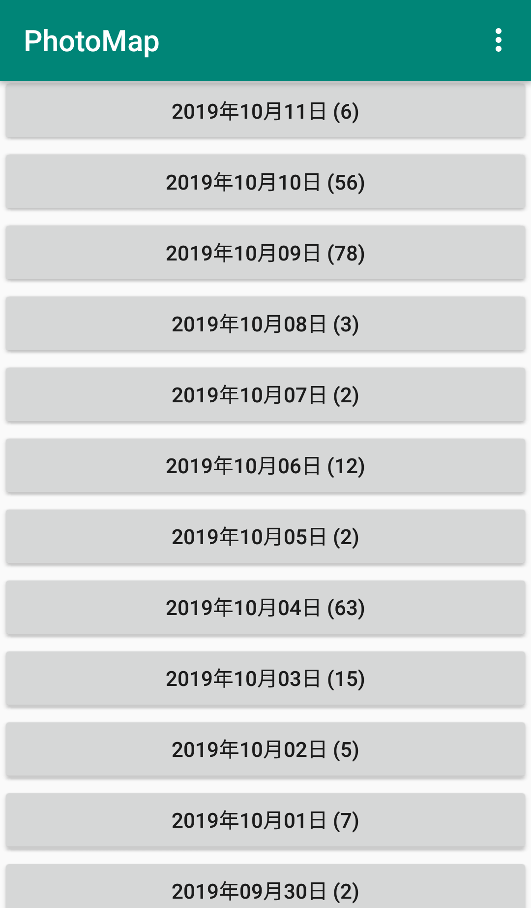
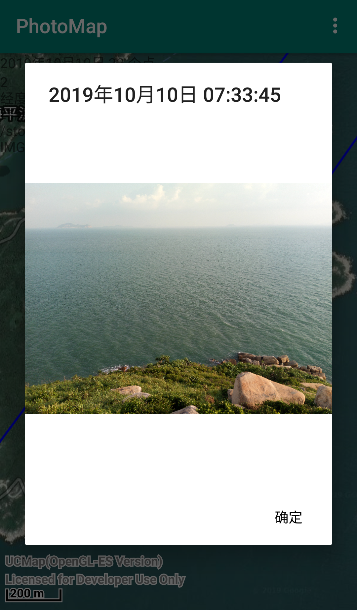

# Android：照片地图
媒体库图片按日期分类，点击日期按钮把这一天的图片的GPS位置在地图上标记并连线，点击标记点显示照片。

### 媒体库图片按日期分类
  

### 地图
  

### 照片
  

### 地图工具

### 参考文献
[坐标转换](https://blog.csdn.net/ma969070578/article/details/41013547)  
[EXIF的GPS数据转经纬度](https://blog.csdn.net/diyangxia/article/details/50995253)